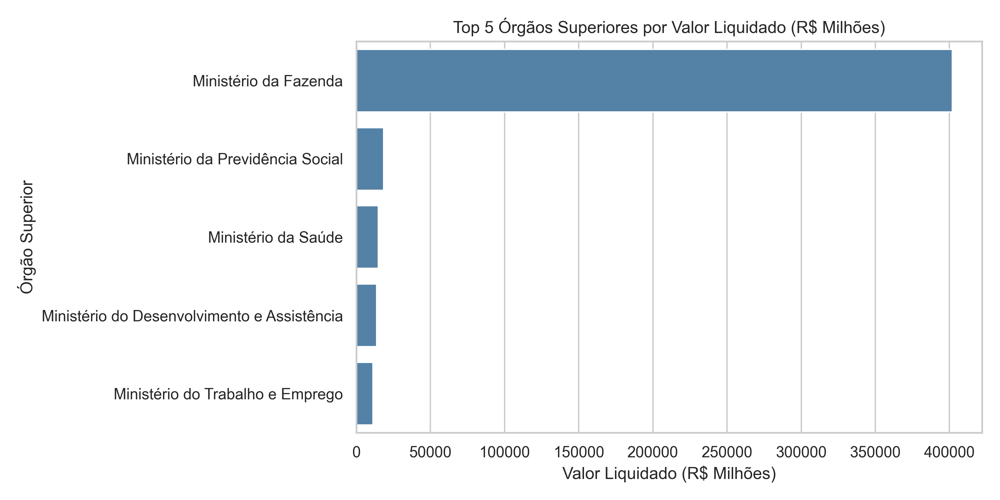
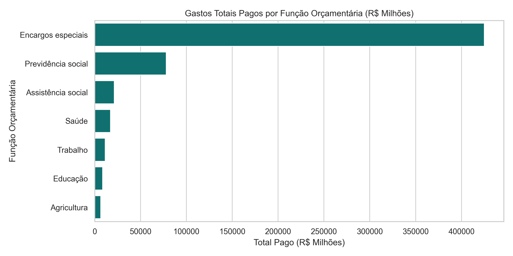
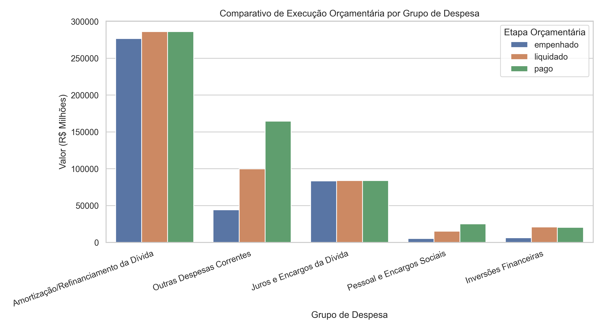

# 📊 Gastos Públicos Federais — Data Warehouse & Analytics

> **Da engenharia de dados à tomada de decisão: uma pipeline completa para transformar dados de despesas públicas em informação analítica.**

---

## 📌 Sobre o projeto

Este projeto implementa uma solução completa de **Engenharia de Dados, Data Warehouse e Análise de Dados** aplicada às despesas públicas federais.

O objetivo é transformar dados brutos de execução orçamentária em uma estrutura analítica organizada, permitindo identificar:

* quais órgãos concentram os maiores gastos;
* quais funções de governo recebem os maiores volumes de recursos;
* como os valores se comportam entre **empenhado, liquidado e pago**;
* onde existem diferenças relevantes na execução financeira;
* quais informações podem apoiar processos de acompanhamento, controle e tomada de decisão.

A solução utiliza uma pipeline de dados desenvolvida em **Python**, com armazenamento em **PostgreSQL**, modelagem dimensional em **Star Schema**, consultas **SQL** e análise e visualização em **Jupyter Notebook**.

---

# 🎯 Problema de negócio

Dados de despesas públicas possuem grande volume e diferentes dimensões de análise.

Quando mantidos apenas em arquivos brutos, torna-se mais difícil realizar cruzamentos consistentes entre:

* órgãos;
* funções de governo;
* grupos de despesa;
* períodos;
* valores empenhados;
* valores liquidados;
* valores pagos.

O desafio deste projeto foi construir uma estrutura que permitisse transformar esses registros em informação analítica.

### Pergunta central

> **Como transformar dados públicos brutos em uma estrutura confiável para analisar a execução das despesas e gerar informações que apoiem decisões?**

---

# 💡 Solução desenvolvida

Foi construída uma pipeline completa:

```text
DADOS BRUTOS
     ↓
EXTRAÇÃO
     ↓
TRANSFORMAÇÃO
     ↓
MODELAGEM DIMENSIONAL
     ↓
POSTGRESQL
     ↓
CONSULTAS SQL
     ↓
ANÁLISE EM PYTHON
     ↓
INDICADORES
     ↓
INSIGHTS
     ↓
APOIO À DECISÃO
```

O resultado é um **Data Warehouse em PostgreSQL**, organizado em modelo dimensional, sobre o qual são realizadas consultas analíticas e visualizações.

---

# 🏗️ Arquitetura da solução

```text
                         ┌─────────────────────┐
                         │    DADOS PÚBLICOS   │
                         │         CSV         │
                         └──────────┬──────────┘
                                    │
                                    ▼
                         ┌─────────────────────┐
                         │       EXTRAÇÃO      │
                         │   servico/scapper   │
                         │        .py          │
                         └──────────┬──────────┘
                                    │
                                    ▼
                         ┌─────────────────────┐
                         │    TRANSFORMAÇÃO    │
                         │ transformador.py    │
                         │                     │
                         │ • tratamento        │
                         │ • padronização      │
                         │ • tipagem           │
                         │ • modelagem         │
                         └──────────┬──────────┘
                                    │
                                    ▼
                         ┌─────────────────────┐
                         │     POSTGRESQL      │
                         │   DATA WAREHOUSE    │
                         └──────────┬──────────┘
                                    │
                                    ▼
                         ┌─────────────────────┐
                         │     STAR SCHEMA     │
                         │                     │
                         │    fato_despesas    │
                         │          +          │
                         │     4 dimensões     │
                         └──────────┬──────────┘
                                    │
                           ┌────────┴────────┐
                           ▼                 ▼
                       ┌───────┐         ┌─────────┐
                       │  SQL  │         │ Python  │
                       └───┬───┘         └────┬────┘
                           │                  │
                           └────────┬─────────┘
                                    ▼
                         ┌─────────────────────┐
                         │      ANALYTICS      │
                         │                     │
                         │ • indicadores      │
                         │ • gráficos         │
                         │ • insights         │
                         │ • pareceres        │
                         └─────────────────────┘
```

---

# 🔄 Pipeline de dados

## 1. Extração

O arquivo:

```text
servico/scapper.py
```

é responsável pela etapa de extração/download dos dados brutos utilizados pelo projeto.

Os dados são disponibilizados na estrutura:

```text
base-dados/
└── 202608_Despesas.csv
```

---

## 2. Transformação

O arquivo:

```text
servico/transformador.py
```

realiza o processo de ETL.

Entre as etapas estão:

* tratamento de valores nulos;
* padronização dos dados;
* definição dos tipos;
* transformação das informações;
* preparação das dimensões;
* construção da modelagem dimensional;
* carga dos dados no PostgreSQL.

---

## 3. Carga

Os dados transformados são carregados no **PostgreSQL**, utilizado como Data Warehouse do projeto.

A estrutura foi organizada para permitir consultas analíticas utilizando SQL.

---

# 🗄️ Data Warehouse

O Data Warehouse utiliza o modelo dimensional **Star Schema**.

A arquitetura é composta por:

### Tabela fato

`fato_despesas`

### Dimensões

* `dim_orgao`
* `dim_funcao`
* `dim_elemento_despesa`
* `dim_tempo`

```text
                         dim_orgao
                             │
                             │
        dim_funcao ─── fato_despesas ─── dim_elemento_despesa
                             │
                             │
                         dim_tempo
```

A tabela fato concentra as principais métricas financeiras:

* `valor_empenhado`
* `valor_liquidado`
* `valor_pago`

As dimensões fornecem o contexto necessário para análise.

---

# 📐 Modelo dimensional

| Tabela                 | Tipo     | Principais informações                 |
| ---------------------- | -------- | -------------------------------------- |
| `fato_despesas`        | Fato     | Valores empenhados, liquidados e pagos |
| `dim_orgao`            | Dimensão | Órgãos superiores e subordinados       |
| `dim_funcao`           | Dimensão | Funções e subfunções de governo        |
| `dim_elemento_despesa` | Dimensão | Grupos e elementos de despesa          |
| `dim_tempo`            | Dimensão | Data, ano, mês e dia                   |

Essa estrutura permite analisar os gastos por diferentes perspectivas e realizar agregações e cruzamentos utilizando SQL.

---

# 📊 Perguntas de negócio e resultados

A análise foi estruturada em três perguntas principais.

---

# 1️⃣ Quais são os 5 órgãos superiores com maiores gastos liquidados?

### Objetivo

Identificar os órgãos que concentram o maior volume de despesas liquidadas no conjunto de dados analisado.

A consulta utiliza:

```text
SUM(valor_liquidado)
```

e apresenta os valores em **R$ milhões**.

### Resultado encontrado

| Ranking | Órgão Superior                              |           Total Liquidado |
| ------: | ------------------------------------------- | ------------------------: |
|       1 | Ministério da Fazenda                       | **R$ 401.848,87 milhões** |
|       2 | Ministério da Previdência Social            |  **R$ 18.502,68 milhões** |
|       3 | Ministério da Saúde                         |  **R$ 14.765,00 milhões** |
|       4 | Ministério do Desenvolvimento e Assistência |  **R$ 13.791,89 milhões** |
|       5 | Ministério do Trabalho e Emprego            |  **R$ 11.196,25 milhões** |

**Fonte:** resultado da consulta executada no `analise_despesas.ipynb`.

### 📊 Visualização — Top 5 órgãos com maiores gastos



### 📌 Principal resultado

O **Ministério da Fazenda apresenta uma concentração muito superior aos demais órgãos do ranking**, com aproximadamente **R$ 401,85 bilhões** liquidados.

Considerando apenas os cinco órgãos apresentados no ranking, o Ministério da Fazenda representa aproximadamente **87,3%** do total liquidado desse grupo.

### 🔎 Interpretação

O resultado evidencia uma forte concentração financeira no Ministério da Fazenda.

Essa concentração precisa ser interpretada considerando a natureza das despesas associadas ao órgão, especialmente aquelas relacionadas à gestão financeira e às obrigações da União.

### 💼 Possível aplicação para gestão

O ranking permite priorizar análises de:

* execução orçamentária;
* composição das despesas;
* contratos e programas;
* variações relevantes;
* concentração de recursos.

> **Insight:** rankings financeiros são úteis para definir onde análises mais detalhadas podem gerar maior impacto.

---

# 2️⃣ Quais áreas/funções de governo concentram os maiores gastos?

### Objetivo

Identificar em quais funções de governo os recursos foram efetivamente pagos.

A consulta utiliza:

```text
SUM(valor_pago)
```

agrupado pela função de governo.

### Resultado encontrado

| Ranking | Função de Governo  |                Total Pago |
| ------: | ------------------ | ------------------------: |
|       1 | Encargos especiais | **R$ 424.877,72 milhões** |
|       2 | Previdência social |  **R$ 77.934,88 milhões** |
|       3 | Assistência social |  **R$ 21.239,99 milhões** |
|       4 | Saúde              |  **R$ 17.261,60 milhões** |
|       5 | Trabalho           |  **R$ 11.361,76 milhões** |
|       6 | Educação           |   **R$ 8.641,26 milhões** |
|       7 | Agricultura        |   **R$ 6.628,05 milhões** |

**Fonte:** resultado da consulta executada no `analise_despesas.ipynb`.

### 📊 Visualização — Gastos por função de governo



### 📌 Principal resultado

**Encargos especiais** apresenta um volume pago de aproximadamente **R$ 424,88 bilhões**, muito acima das demais funções analisadas.

Entre as funções apresentadas, Previdência Social aparece em segundo lugar, com aproximadamente **R$ 77,93 bilhões**.

### Comparação

O valor pago em Encargos Especiais corresponde a aproximadamente **5,45 vezes** o valor pago em Previdência Social.

Além disso, considerando apenas as sete funções apresentadas, Encargos Especiais representa aproximadamente **74,8%** do total.

### 🔎 Interpretação

O resultado demonstra que a distribuição dos pagamentos não está concentrada apenas em políticas sociais diretamente identificáveis.

A categoria **Encargos Especiais** possui forte peso no resultado financeiro e, por isso, merece análise específica de sua composição.

### 💼 Possível aplicação para gestão

A análise por função permite:

* acompanhar a distribuição dos recursos;
* identificar concentração orçamentária;
* comparar áreas de governo;
* investigar alterações relevantes;
* apoiar análises de planejamento e execução.

> **Insight:** olhar apenas para o órgão não é suficiente. A análise por função revela **para qual finalidade orçamentária os recursos estão sendo direcionados**.

---

# 3️⃣ Como ocorre a execução entre Empenhado, Liquidado e Pago?

### Objetivo

Comparar as principais etapas da execução financeira:

**Empenhado → Liquidado → Pago**

A consulta agrupa os dados por grupo de despesa e retorna os cinco grupos com maior valor pago.

---

## Resultado encontrado

| Grupo de Despesa                      |        Empenhado |        Liquidado |             Pago |
| ------------------------------------- | ---------------: | ---------------: | ---------------: |
| Amortização/Refinanciamento da Dívida | R$ 276.821,34 mi | R$ 286.205,32 mi | R$ 286.205,32 mi |
| Outras Despesas Correntes             |  R$ 44.104,97 mi |  R$ 99.909,97 mi | R$ 164.589,90 mi |
| Juros e Encargos da Dívida            |  R$ 83.489,22 mi |  R$ 83.848,99 mi |  R$ 83.848,99 mi |
| Pessoal e Encargos Sociais            |   R$ 5.175,96 mi |  R$ 15.104,53 mi |  R$ 25.196,55 mi |
| Inversões Financeiras                 |   R$ 6.313,59 mi |  R$ 20.914,68 mi |  R$ 20.384,62 mi |

**Fonte:** resultado da terceira consulta executada no `analise_despesas.ipynb`.

### 📊 Visualização — Execução por grupo de despesa



---

## 📌 O que os números mostram?

### Amortização/Refinanciamento da Dívida

O grupo apresenta:

* **R$ 276,82 bilhões empenhados**
* **R$ 286,21 bilhões liquidados**
* **R$ 286,21 bilhões pagos**

O valor liquidado é praticamente integralmente convertido em pagamento no resultado apresentado.

### Juros e Encargos da Dívida

Apresenta:

* **R$ 83,49 bilhões empenhados**
* **R$ 83,85 bilhões liquidados**
* **R$ 83,85 bilhões pagos**

Novamente, existe elevada proximidade entre liquidado e pago.

### Inversões Financeiras

Apresenta:

* **R$ 6,31 bilhões empenhados**
* **R$ 20,91 bilhões liquidados**
* **R$ 20,38 bilhões pagos**

Nesse grupo, o valor pago fica ligeiramente abaixo do liquidado.

### Outras Despesas Correntes

Apresenta:

* **R$ 44,10 bilhões empenhados**
* **R$ 99,91 bilhões liquidados**
* **R$ 164,59 bilhões pagos**

É um dos resultados que mais chama atenção pela diferença entre as etapas.

### Pessoal e Encargos Sociais

Apresenta:

* **R$ 5,18 bilhões empenhados**
* **R$ 15,10 bilhões liquidados**
* **R$ 25,20 bilhões pagos**

Também apresenta diferenças expressivas entre as três etapas.

---

# ⚠️ Ponto de atenção identificado nos dados

Um dos resultados mais importantes do projeto não é apenas o ranking.

É a existência de **diferenças relevantes entre empenhado, liquidado e pago** em alguns grupos de despesa.

Por exemplo:

### Outras Despesas Correntes

```text
Empenhado     R$ 44,10 bi
       ↓
Liquidado     R$ 99,91 bi
       ↓
Pago          R$ 164,59 bi
```

### Pessoal e Encargos Sociais

```text
Empenhado     R$ 5,18 bi
       ↓
Liquidado     R$ 15,10 bi
       ↓
Pago          R$ 25,20 bi
```

Esses resultados **não devem ser automaticamente interpretados como erro ou irregularidade**.

Eles indicam um ponto que merece investigação sobre:

* período de referência;
* natureza dos registros;
* regras de contabilização;
* abrangência da base;
* relacionamento entre as etapas;
* possíveis efeitos de registros acumulados.

Esse é justamente um dos papéis da análise de dados:

> **identificar padrões que merecem ser investigados, sem transformar automaticamente uma anomalia estatística em uma conclusão.**

---

# 🧠 Principais insights do projeto

A análise permite destacar cinco conclusões principais.

### 1. Existe forte concentração financeira

O Ministério da Fazenda aparece muito acima dos demais órgãos no ranking de despesas liquidadas.

### 2. Encargos especiais domina a análise por função

A função apresenta aproximadamente **R$ 424,88 bilhões pagos**, muito acima da segunda colocada, Previdência Social.

### 3. Previdência Social possui participação expressiva

Com aproximadamente **R$ 77,93 bilhões pagos**, aparece como a segunda maior função entre os resultados apresentados.

### 4. A execução financeira apresenta comportamentos diferentes entre grupos

Alguns grupos apresentam grande proximidade entre liquidado e pago, enquanto outros apresentam diferenças relevantes.

### 5. Os resultados também ajudam a identificar perguntas adicionais

A análise não termina no gráfico.

Os resultados levantam novas questões:

* Por que alguns grupos apresentam diferenças tão grandes entre as etapas?
* Qual é o período efetivamente representado por cada registro?
* Qual a composição de Encargos Especiais?
* Quais elementos de despesa explicam a concentração?
* Como esses indicadores se comportariam em uma série histórica?

---

# 🎯 Das métricas às decisões

O objetivo do projeto não é simplesmente gerar gráficos.

A lógica utilizada é:

```text
DADO
  ↓
INFORMAÇÃO
  ↓
INDICADOR
  ↓
INSIGHT
  ↓
PERGUNTA DE INVESTIGAÇÃO
  ↓
DECISÃO
```

### Exemplo

```text
Alta concentração de gastos
        ↓
Identificação do órgão/função
        ↓
Análise da composição
        ↓
Identificação dos principais grupos
        ↓
Investigação das causas
        ↓
Apoio ao controle e planejamento
```

---

# 🛠️ Tecnologias utilizadas

| Tecnologia           | Utilização                              |
| -------------------- | --------------------------------------- |
| **Python 3.11+**     | ETL e análise                           |
| **Pandas**           | Manipulação dos dados                   |
| **PostgreSQL**       | Data Warehouse                          |
| **SQL**              | Consultas analíticas                    |
| **SQLAlchemy**       | Conexão Python/PostgreSQL               |
| **Psycopg2**         | Conexão com PostgreSQL                  |
| **Matplotlib**       | Visualização                            |
| **Seaborn**          | Visualização                            |
| **Jupyter Notebook** | Análise exploratória                    |
| **python-dotenv**    | Gerenciamento das variáveis de ambiente |
| **Logging**          | Monitoramento da execução               |

---

# 📂 Estrutura do projeto

```text
Projeto_Gastos_Publicos/
│
├── base-dados/
│   └── 202608_Despesas.csv
│
├── graficos/
│   ├── 1_top5_orgaos_gastos.png
│   ├── 2_gastos_por_funcao.png
│   └── 3_execucao_por_grupo.png
│
├── servico/
│   ├── scapper.py
│   └── transformador.py
│
├── .gitignore
├── analise_despesas.ipynb
├── main.py
├── requirements.txt
└── README.md
```

> `__pycache__` pode ser gerado automaticamente durante a execução do Python e representa um artefato do ambiente de execução.

---

# ▶️ Como executar

## 1. Instalar as dependências

```bash
pip install -r requirements.txt
```

## 2. Configurar o PostgreSQL

Criar um arquivo `.env` na raiz:

```env
DB_USER=postgres
DB_PASSWORD=SuaSenhaAqui
DB_HOST=127.0.0.1
DB_PORT=5432
DB_NAME=dw_gastos_publicos
```

O arquivo `.env` não deve ser versionado.

## 3. Executar a pipeline

```bash
python main.py
```

O processo executa as etapas de:

1. extração;
2. transformação;
3. modelagem;
4. carga no Data Warehouse;
5. registro da execução.

## 4. Executar a análise

Abrir:

```text
analise_despesas.ipynb
```

O notebook realiza as consultas SQL, gera as visualizações e apresenta os resultados analíticos.

---

# 🔐 Segurança e monitoramento

O projeto utiliza:

* `.env` para variáveis de ambiente;
* `.gitignore` para evitar o versionamento de credenciais;
* `logging` para registrar a execução da pipeline;
* `execucao_etl.log` para acompanhamento do processamento.

---

# 🚀 Possíveis evoluções

O projeto pode evoluir para uma arquitetura ainda mais próxima de um ambiente profissional.

## Orquestração

Implementação de:

* Apache Airflow;
* Prefect.

Objetivo:

* agendamento;
* dependências entre tarefas;
* monitoramento;
* recuperação de falhas.

## Data Quality

Implementação de regras automatizadas para:

* valores nulos;
* duplicidades;
* integridade referencial;
* consistência dos valores;
* validação de schema.

## Histórico

Adicionar diferentes períodos para permitir análises temporais:

```text
2024
 ↓
2025
 ↓
2026
```

Isso permitiria identificar:

* tendências;
* crescimento;
* redução;
* sazonalidade;
* mudanças na composição dos gastos.

## Business Intelligence

Conectar o Data Warehouse a uma ferramenta como:

* Power BI;
* Looker Studio.

Possibilitando dashboards para acompanhamento dos principais indicadores.

---

# 📌 O que este projeto demonstra

Este projeto demonstra conhecimentos aplicados em diferentes etapas do ciclo de dados.

### Engenharia de Dados

* ETL;
* automação;
* transformação;
* logging;
* carga de dados.

### Banco de Dados

* PostgreSQL;
* SQL;
* relacionamentos;
* chaves;
* consultas analíticas.

### Data Warehouse

* modelagem dimensional;
* Star Schema;
* tabela fato;
* dimensões.

### Data Analytics

* análise exploratória;
* agregações;
* indicadores;
* visualização;
* interpretação de resultados.

### Business Intelligence

* perguntas de negócio;
* análise multidimensional;
* geração de insights;
* apoio à tomada de decisão.

---

# 🎓 Conclusão

Este projeto demonstra como uma base pública de despesas pode ser transformada em uma solução analítica estruturada.

O trabalho não se limita à criação de gráficos.

Ele percorre todo o ciclo:

```text
DADO BRUTO
     ↓
ETL
     ↓
MODELAGEM
     ↓
DATA WAREHOUSE
     ↓
SQL
     ↓
ANÁLISE
     ↓
INDICADORES
     ↓
INSIGHTS
     ↓
DECISÃO
```

Os resultados mostram forte concentração dos gastos em determinados órgãos e funções, além de diferenças relevantes entre as etapas de empenho, liquidação e pagamento em alguns grupos de despesa.

Mais importante do que apresentar esses números é utilizar os resultados para **formular novas perguntas, identificar pontos de atenção e apoiar análises mais aprofundadas**.

Esse é o papel da análise de dados:

> **Transformar registros em evidências para melhorar a compreensão de um problema e apoiar decisões.**

---

# 👩‍💻 Autoria

**Caroline de Souza Cunha Lopes**

**Programa:** Carreira Tech — SENAI/SCTEC
**Módulo:** Módulo 2 — Arquitetura e Modelagem de Dados
**Turma:** T1

---

## 🔗 Repositório

**Projeto_Gastos_Publicos**

---

### Keywords

`Data Engineering` · `Data Warehouse` · `PostgreSQL` · `SQL` · `Python` · `ETL` · `Data Analytics` · `Business Intelligence` · `Star Schema` · `Data Modeling` · `Public Data` · `Government Data`


